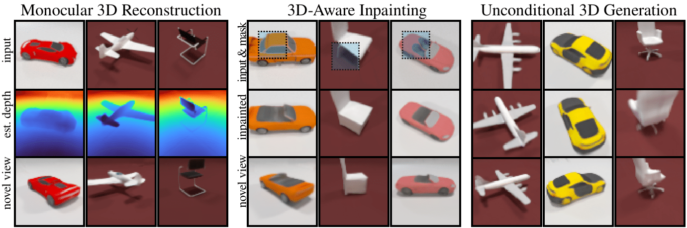
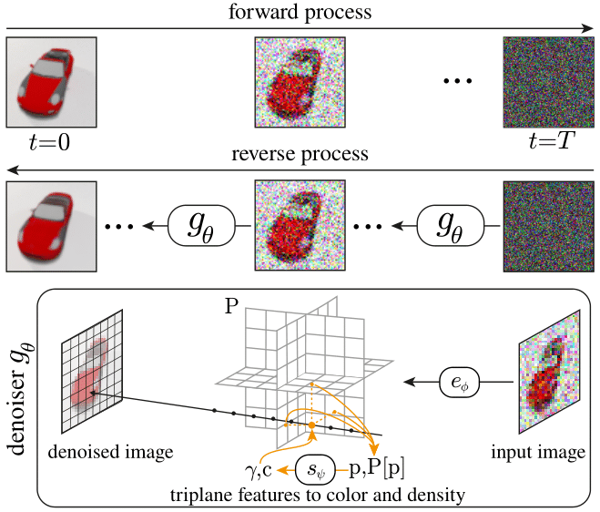
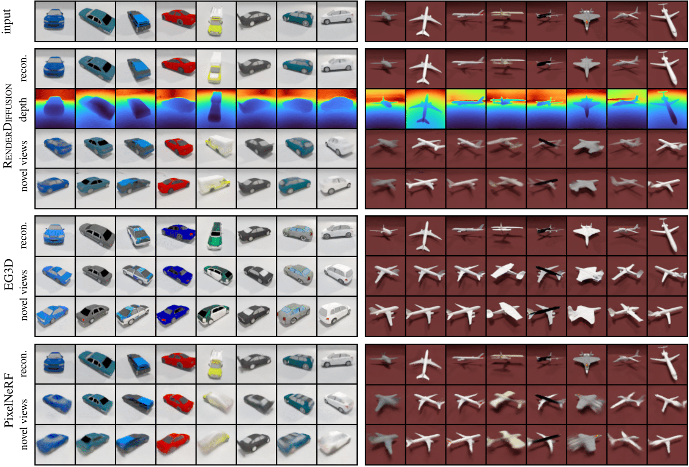
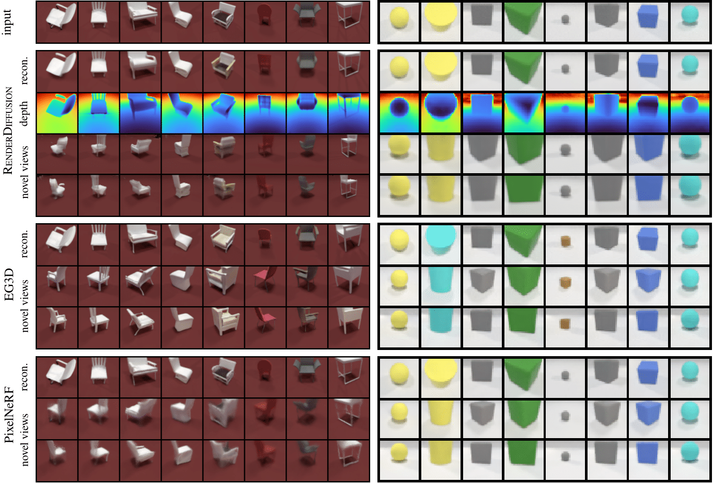
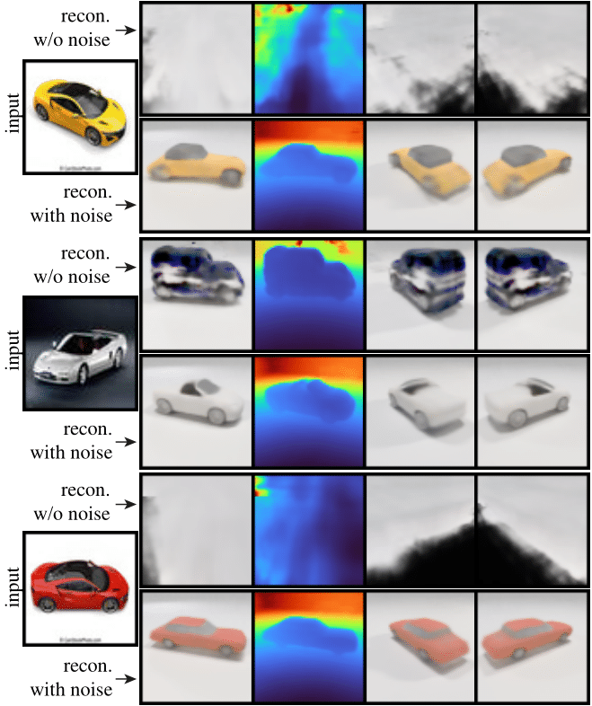
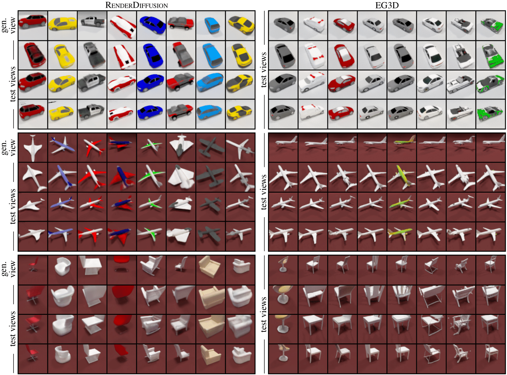
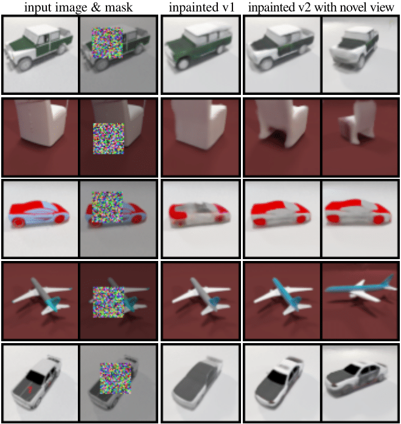

## <br><sub>RenderDiffusion: Image Diffusion for 3D Reconstruction, Inpainting and Generation</sub>

*Titas Anciukevičius‬, Zexiang Xu, Matthew Fisher, Paul Henderson, Hakan Bilen, Niloy J. Mitra, Paul Guerrero*




**Abstract**: Diffusion models currently achieve state-of-the-art performance for both conditional and unconditional image generation.
However, so far, image diffusion models do not support tasks required for 3D understanding, such as view-consistent 3D generation or single-view object reconstruction. 
In this paper, we present RenderDiffusion as the first diffusion model for 3D generation and inference that can be trained using only monocular 2D supervision.
At the heart of our method is a novel image denoising
architecture that generates and renders an intermediate three-dimensional
representation of a scene in each denoising step. 
This enforces a strong inductive structure into the diffusion process that gives us a 3D consistent representation while only requiring
2D supervision. 
The resulting 3D representation can be rendered from any viewpoint.
We evaluate RenderDiffusion on ShapeNet and Clevr datasets
and show competitive performance for generation of 3D scenes and inference of 3D scenes from 2D images. Additionally, our diffusion-based approach allows us to use 2D inpainting to edit 3D scenes. We believe that our work promises to enable full 3D generation at scale when trained on massive image collections, thus circumventing the need to have large-scale 3D model collections for supervision.


## Model
Our method builds on the successful training and generation setup of 2D image diffusion models, which are trained to denoise input images that have various amounts of added noise. At test time, novel images are generated by applying the model in multiple steps to progressively recover an image starting from pure noise samples. We keep this training and generation setup, but modify the architecture of the main denoiser to encode the noisy input image into a 3D representation of the scene 
that is volumetrically rendered to obtain the denoised output image.
This introduces an inductive bias that favors 3D scene consistency, and allows us to render the 3D representation from novel viewpoints. Figure below shows an overview of our architecture.



## Results
We evaluate RenderDiffusion on three tasks: monocular 3D reconstruction, unconditional generation, and 3D-aware inpainting.

### 3D reconstruction
Unlike existing 2D diffusion models, we can use RenderDiffusion to reconstruct 3D scenes from 2D images. To reconstruct the scene shown in an input image $\\mathbf{x}\_0$, we pass it through the forward process for $t\_r \le T$ steps, and then denoise it in the reverse process using our learned denoiser $g\_\theta$. In the final denoising step, the triplanes encode a 3D scene that can be rendered from novel viewpoints. The choice of $t\_r$ introduces an interesting control that is not available in existing 3D reconstruction methods. It allows us to trade off between reconstruction fidelity and generalization to out-of-distribution input images: At $t\_r=0$, no noise is added to the input image and the 3D reconstruction reproduces the scene shown in the input image as accurately as possible; however, out-of-distribution images cannot be handled. With larger values for $t\_r$, input images that are increasingly out-of-distribution can be handled, as the denoiser can move the input images towards the learned distribution. This comes at the cost of reduced reconstruction fidelity, as the added noise removes some detail from the input image, which the denoiser fills in with generated content.





Using a 3D-aware denoiser allows us to reconstruct a 3D scene from noisy images, where information that is lost to the noise is filled in with generated content. By adding more noise, we can generalize to input images that are increasingly out-of-distribution, at the cost of reconstruction fidelity. In figure below, we show 3D reconstructions from photos that have significantly different backgrounds and materials than the images seen at training time. We see that results with added noise ( $t\_{r}=40$ ) generalize better than results without added noise ( $t\_{r}=0$ ), at the cost of less accurate shapes and poses of the reconstructed models.



### Unconditional Generation

Below we show qualitative results for unconditional generation.



### 3D-aware inpainting

Lastly, we apply our trained model to the task of inpainting masked 2D regions of an image while simultaneously reconstructing the 3D shape it shows.
We follow an approach similar to [RePaint](https://github.com/andreas128/RePaint), but using our 3D denoiser instead of their 2D architecture.
Specifically, we condition the denoising iterations on the known regions of the image, 
by setting $\\mathbf{x}\_{t-1}$ in known regions to the noised target pixels, while sampling the unknown regions as usual based on $\\mathbf{x}\_t$.
Thus, the model performs 3D-aware inpainting, finding a latent 3D structure that is consistent with the observed part of the image, and also plausible in the masked part.



## Code

To aid reproducibility, we will soon release our datasets, code, and checkpoints.

## Related work
Check out related prior and concurrent work:
* [PixelNeRF](https://github.com/sxyu/pixel-nerf) is a non-generative method for inference of implicit 3D representations.
* [EG3D](https://github.com/NVlabs/eg3d) is a generative 3D model based on GANs with triplane representation. 
* Concurrently, [GAUDI](https://github.com/apple/ml-gaudi) presents a diffusion model for generation of 3D camera paths and up to 300 scenes. However, unlike ours, it requires 2 stages of training, with the diffusion model operating only on latent space. In contrast, our diffusion model is defined directly over pixels - this allows exciting applications, such as refinement of generated image and inpainting.


## Citation
```
@article{anciukevicius2022renderdiffusion,
	title        = {{RenderDiffusion}: Image Diffusion for {3D} Reconstruction, Inpainting and Generation},
	author       = {Titas Anciukevicius and Zexiang Xu and Matthew Fisher and Paul Henderson and Hakan Bilen and Mitra, Niloy J. and Paul Guerrero},
	year         = 2022,
	journal      = {arXiv}
}
```
